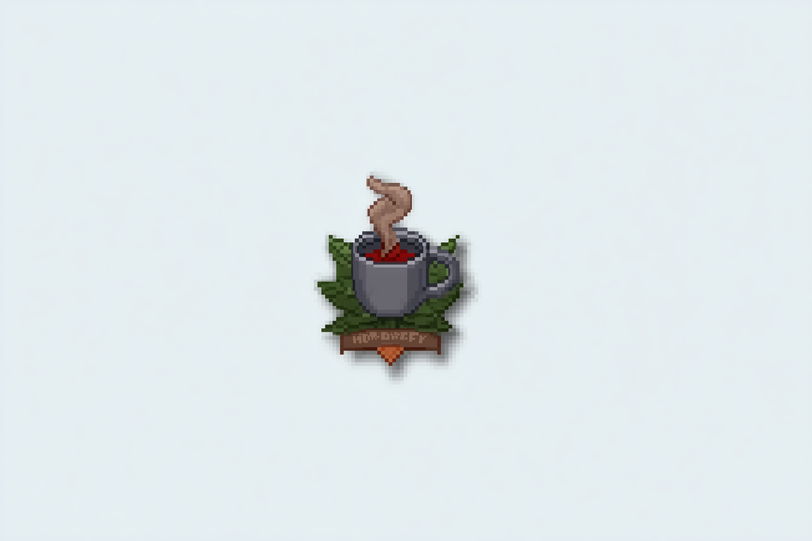

<p align="center">
  
</p>

# Homebrewify

**Convert D&D campaign markdown to professional Homebrewery format**

A TypeScript CLI tool that transforms your campaign notes into beautifully formatted D&D sourcebook content using [The Homebrewery](https://homebrewery.naturalcrit.com/).

Listen listen, you find the website The Homebrewery and you think dang this is sick! But, its too annoying to learn their syntax and you think "why cant my trusty AI robot friend do this?" Well now just generate your D&D campaign and let Homebrewify make it into plausible Markdown that the Homebrewery website can recognize and its done 70% of the work for you! 
---

## Features

- **Automatic Content Detection** - Identifies monsters, magic items, locations, NPCs, and more
- **Monster Stat Blocks** - Generates properly formatted `{{monster,frame}}` blocks with ability scores, actions, and legendary abilities
- **Magic Items** - Creates item blocks with rarity, attunement, and descriptions
- **Read-Aloud Text** - Converts blockquotes to `{{descriptive}}` boxes
- **Document Structure** - Generates cover pages, table of contents, and part dividers
- **Validation** - Checks for unclosed blocks, page overflow, and formatting issues
- **Auto-Fix** - Automatically repairs common formatting problems

---

## Installation

```bash
# Clone the repository
git clone https://github.com/yourusername/homebrewify.git
cd homebrewify

# Install dependencies
npm install

# Build the project
npm run build

# Run globally (optional)
npm link
```

---

## Usage

### Convert a File

```bash
# Basic conversion
homebrewify convert ./my-adventure.md -o ./output.md

# With validation and auto-fix
homebrewify convert ./adventure.md -o ./output.md --validate --auto-fix

# With all structural elements
homebrewify convert ./adventure.md -o ./output.md --cover --toc --part-covers --drop-caps

# Copy to clipboard
homebrewify convert ./adventure.md --clipboard
```

### Convert a Directory

```bash
homebrewify convert ./campaign-notes/ -o ./output/
```

### Validate Existing Homebrewery Markdown

```bash
# Check for issues
homebrewify validate ./my-brew.md

# Fix issues automatically
homebrewify validate ./my-brew.md --fix -o ./fixed.md
```

### Analyze Document Structure

```bash
homebrewify structure ./adventure.md
```

### Generate Individual Elements

```bash
# Monster stat block
homebrewify monster "Shadow Drake" --cr 3 --type dragon --size medium

# Magic item
homebrewify item "Cloak of Shadows" --rarity rare --attunement

# Spell
homebrewify spell "Frostbite" --level 2 --school evocation
```

---

## Supported Content Types

| Content Type | Input Pattern | Output Format |
|--------------|---------------|---------------|
| Monsters | AC, HP, ability scores | `{{monster,frame}}` |
| Magic Items | Rarity, attunement keywords | Formatted item block |
| Read-Aloud | Blockquotes (`>`) | `{{descriptive}}` |
| DM Notes | "DM Note:", "Secret:" | `{{note}}` |
| Locations | "Location:", "Town of" | Wide headers |
| Tables | Markdown tables | `{{classTable,frame}}` |
| Chapters | "Chapter X:", "Episode X:" | Page headers with dropcaps |

---

## Example Transformation

### Input (Plain Markdown)

```markdown
## Shadow Drake
Medium dragon, neutral evil

**Armor Class** 15 (natural armor)
**Hit Points** 52 (8d8 + 16)
**Speed** 30 ft., fly 60 ft.

STR 16 (+3) | DEX 14 (+2) | CON 14 (+2) | INT 8 (-1) | WIS 12 (+1) | CHA 10 (+0)

### Actions
**Bite.** Melee Weapon Attack: +5 to hit, reach 5 ft., one target.
Hit: 10 (2d6 + 3) piercing damage.

**Shadow Breath (Recharge 5-6).** The drake exhales shadowy flames
in a 15-foot cone. Each creature must make a DC 12 Dexterity saving
throw, taking 21 (6d6) necrotic damage on a failure.
```

### Output (Homebrewery Format)

```markdown
{{monster,frame
## Shadow Drake
*Medium dragon, neutral evil*
___
**Armor Class** :: 15 (natural armor)
**Hit Points** :: 52 (8d8 + 16)
**Speed** :: 30 ft., fly 60 ft.
___
|STR|DEX|CON|INT|WIS|CHA|
|:---:|:---:|:---:|:---:|:---:|:---:|
|16 (+3)|14 (+2)|14 (+2)|8 (-1)|12 (+1)|10 (+0)|
___
### Actions
***Bite.*** *Melee Weapon Attack:* +5 to hit, reach 5 ft., one target.
*Hit:* 10 (2d6 + 3) piercing damage.
:
***Shadow Breath (Recharge 5-6).*** The drake exhales shadowy flames
in a 15-foot cone. Each creature must make a DC 12 Dexterity saving
throw, taking 21 (6d6) necrotic damage on a failure.
}}
```

---

## CLI Options

### Convert Command

| Option | Description |
|--------|-------------|
| `-o, --output <path>` | Output file or directory |
| `-c, --clipboard` | Copy output to clipboard |
| `-f, --format <format>` | Input format: auto, obsidian, raw |
| `-t, --template <template>` | Template style: phb, dmg |
| `--validate` | Run validation and show warnings |
| `--auto-fix` | Automatically fix validation issues |
| `--cover` | Generate cover page |
| `--toc` | Generate table of contents |
| `--part-covers` | Generate part/act divider pages |
| `--drop-caps` | Add drop caps to chapter starts |
| `--page-numbers` | Add page numbers |
| `-v, --verbose` | Show detailed output |

---

## Project Structure

```
homebrewify/
├── src/
│   ├── index.ts              # CLI entry point
│   ├── types.ts              # TypeScript interfaces
│   ├── parser/
│   │   ├── markdown.ts       # Markdown parser
│   │   └── detector.ts       # Content type detection
│   ├── transformers/
│   │   ├── index.ts          # Transformer orchestration
│   │   ├── monster.ts        # Monster stat blocks
│   │   ├── item.ts           # Magic items
│   │   ├── spell.ts          # Spells
│   │   ├── cover.ts          # Cover pages
│   │   ├── toc.ts            # Table of contents
│   │   └── ...               # Other transformers
│   ├── structure/
│   │   ├── analyzer.ts       # Document structure analysis
│   │   └── generator.ts      # Structure generation
│   └── validator/
│       ├── index.ts          # Validation orchestration
│       ├── blockMatcher.ts   # Block syntax validation
│       └── pageEstimator.ts  # Page fill estimation
├── samples/                  # Example files
├── dist/                     # Compiled output
├── package.json
└── tsconfig.json
```

---

## Configuration

Create a `homebrewify.config.yaml` file in your project root:

```yaml
# Template style
template: phb   # phb or dmg

# Page layout
columns: 2
pageSize: letter

# Document generation
document:
  generateCover: true
  generateToc: true
  generatePartCovers: true
  dropCaps: true
  pageNumbers: true

# Image handling
images:
  placeholders: true
  coverImage: "./cover.jpg"
```

---

## Homebrewery Syntax Reference

| Syntax | Purpose |
|--------|---------|
| `\page` | Page break |
| `\column` | Column break |
| `{{monster,frame}}` | Monster stat block |
| `{{descriptive}}` | Read-aloud text (tan box) |
| `{{note}}` | DM notes (green box) |
| `{{classTable,frame}}` | Styled tables |
| `{{wide}}` | Full-width content |
| `{{dropcap X}}` | Decorative first letter |
| `{{cover}}` | Cover page styling |

---

## Requirements

- Node.js 18.0.0 or higher
- npm or yarn

---

## Development

```bash
# Install dependencies
npm install

# Build
npm run build

# Watch mode
npm run dev

# Type checking
npm run typecheck
```

---

## Sample Output

The `samples/` directory contains example conversions:

- `rekkenmark-rebuilt.md` - A complete D&D adventure with monsters, magic items, and multiple chapters

---

## Contributing

Contributions are welcome! Please feel free to submit a Pull Request.

1. Fork the repository
2. Create your feature branch (`git checkout -b feature/amazing-feature`)
3. Commit your changes (`git commit -m 'Add amazing feature'`)
4. Push to the branch (`git push origin feature/amazing-feature`)
5. Open a Pull Request

---

## License

MIT License - see [LICENSE](LICENSE) for details.

---

## Acknowledgments

- [The Homebrewery](https://homebrewery.naturalcrit.com/) for the amazing D&D content creation tool
- [D&D 5th Edition](https://dnd.wizards.com/) for the inspiration

---

*Transform your campaign notes into professional D&D sourcebooks with ease!*
